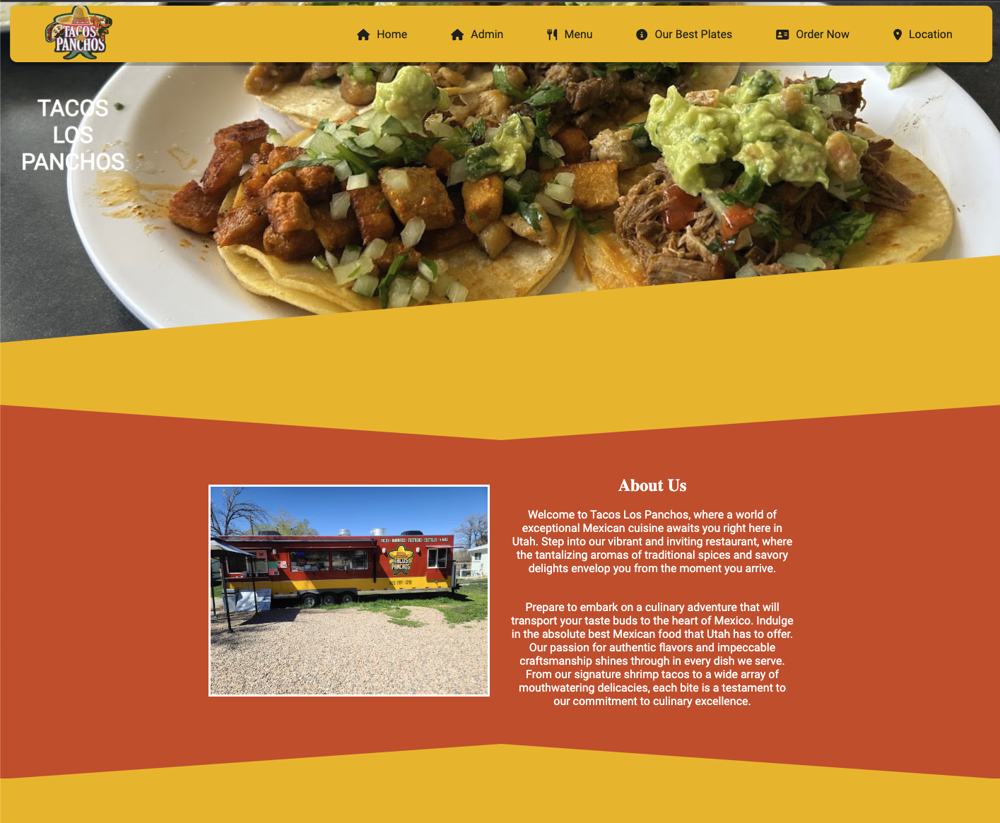
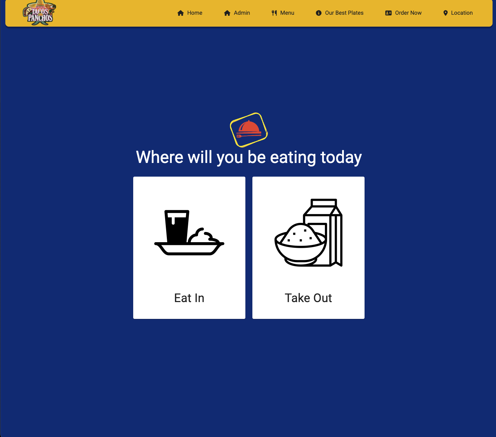
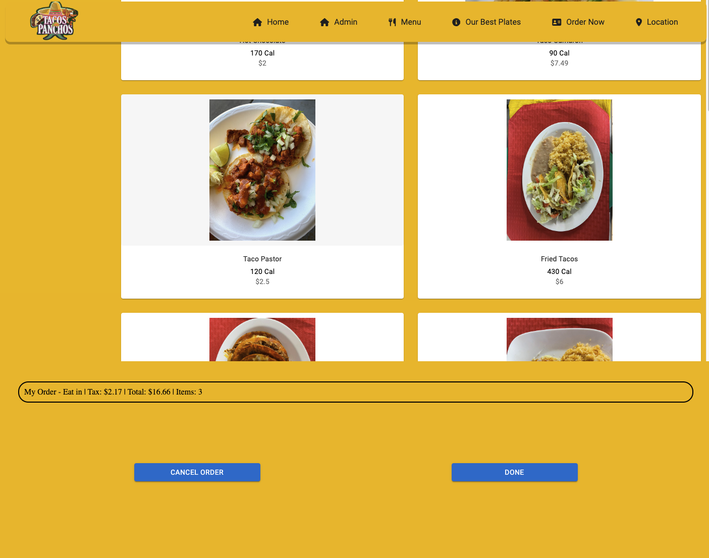
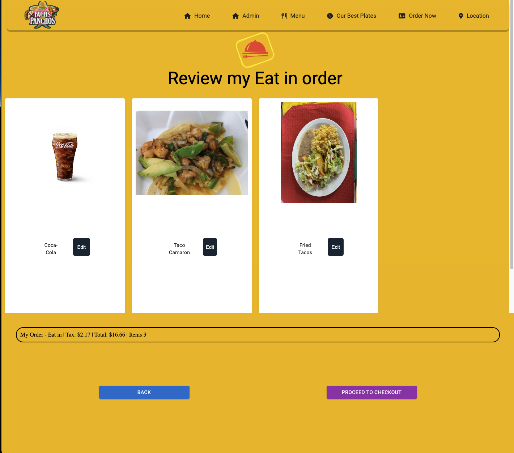
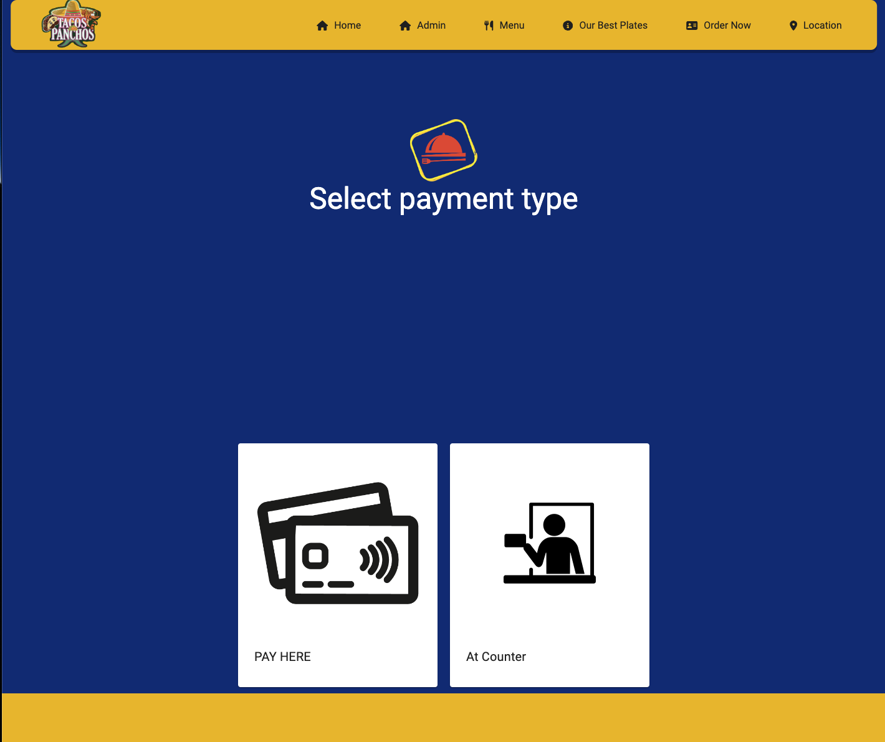
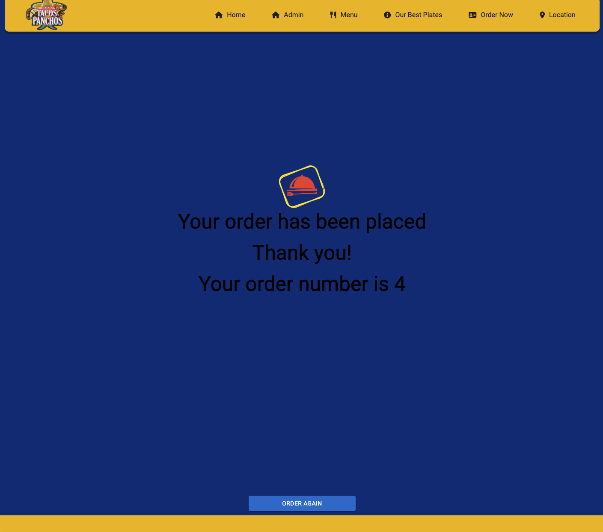
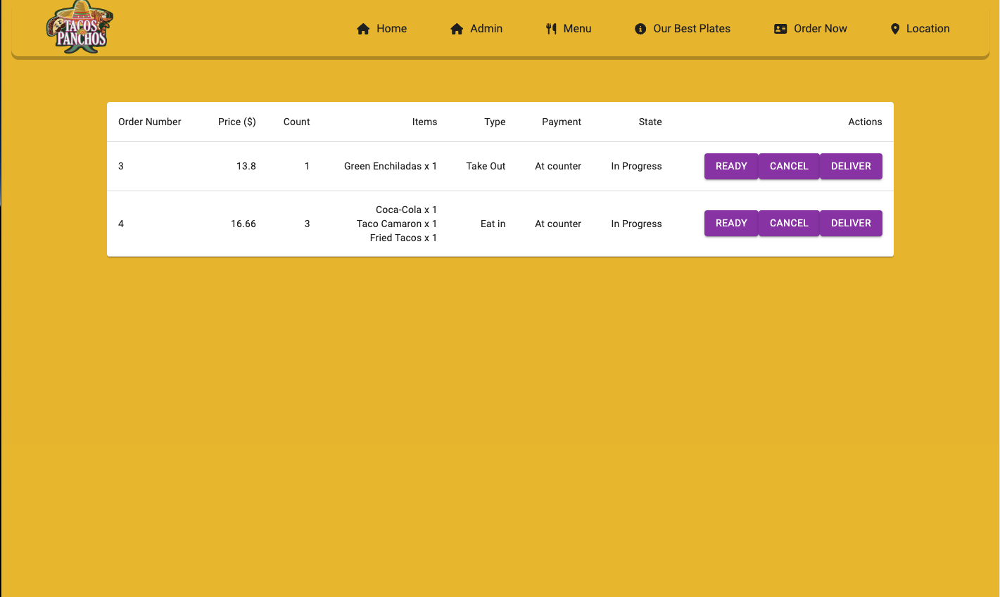

# E-Commerce Restaurant Website

This repository contains the code for an E-Commerce restaurant website. The website provides a platform for users to explore a variety of dishes offered by the restaurant. Users can view the menu, check out dish descriptions, and browse pictures of the available plates. Additionally, the website allows users to place online orders for both takeout and dine-in options. The website also includes an admin page that provides access to order management, allowing administrators to view and process customer orders.

website: https://tacoslospanchosexample-4b92243c5b07.herokuapp.com/

## Features

- Menu: Browse through a comprehensive menu of dishes offered by the restaurant.
- Dish Descriptions: Access detailed descriptions of each dish, including ingredients, nutritional information, and other relevant details.
- Plate Pictures: View high-quality pictures of the dishes to get a visual representation of the menu items.
- Online Ordering: Place orders online, selecting either takeout or dine-in options.
- Admin Page: Administrators can access an admin page to manage and track all customer orders.
- Order Management: View and process customer orders, update order status, and track order fulfillment.

## Installation

To run the E-Commerce restaurant website locally, follow these steps:

- Clone the repository: git clone <[E-Commerce Restaurant Website](https://github.com/MXCAZ/tacosLosPanchosExample)>
- Install the required dependencies: npm install
- Configure the database connection and other environment variables as needed.
- Run the application: npm start
- Access the website in your web browser at http://localhost:3000.

## Technologies Used

- React: JavaScript library for building user interfaces.
- Vite: A fast build tool and development server for modern web applications, providing an optimized development experience with native ES modules support.
- HTML: Markup language for structuring the web pages.
- CSS: Styling language for enhancing the visual presentation.
- JavaScript: Programming language for implementing interactive website functionality.
- Node.js: Runtime environment for server-side JavaScript execution.
- Express.js: Web application framework for building server-side applications.
- MongoDB: NoSQL database for storing and retrieving data.
- Framer Motion: A library used for creating animations and transitions in React applications.
- Mui material: : An open-source React library that provides pre-designed components and styles to build user interfaces.
- SweetAlert2: A JavaScript library that offers beautiful and customizable pop-up alerts, dialogs, and modals.
- EmailJs: A service that simplifies sending emails using JavaScript without the need for server-side code.

## Contributions

Contributions to the project are welcome. If you encounter any issues or have suggestions for improvements, please open an issue or submit a pull request. For major changes, please discuss them in advance to ensure they align with the project's goals.

## This project has the following features:

                * Home page of the website.

                * Order Online build with Mui material.

               * Chose if you are going to Take Out or Eat In.

               * Select your food

              * Review your order and see the price

              * Select your payment method

               * See your order Number

                * Admin page

## License

This project is licensed under the MIT License. Feel free to use and modify the codebase as per the terms of the license.

If you have any questions or need further assistance, please feel free to contact Francisco Sanchez via svfran0517@gmail.com

Enjoy exploring the E-Commerce restaurant website and have a great dining experience!
